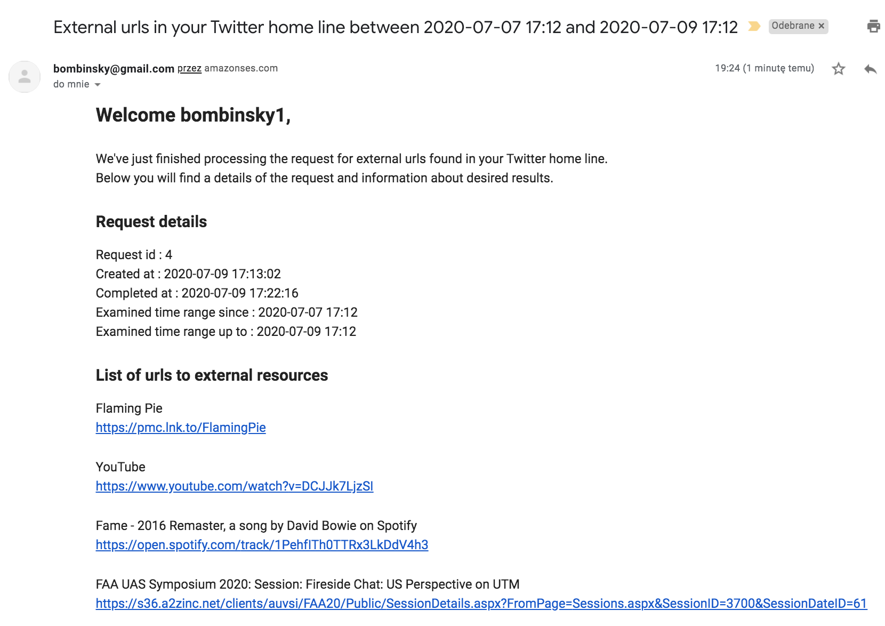
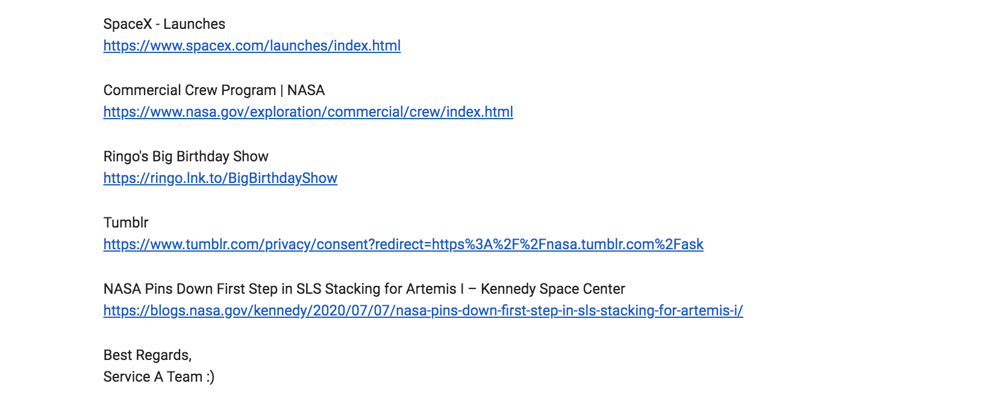
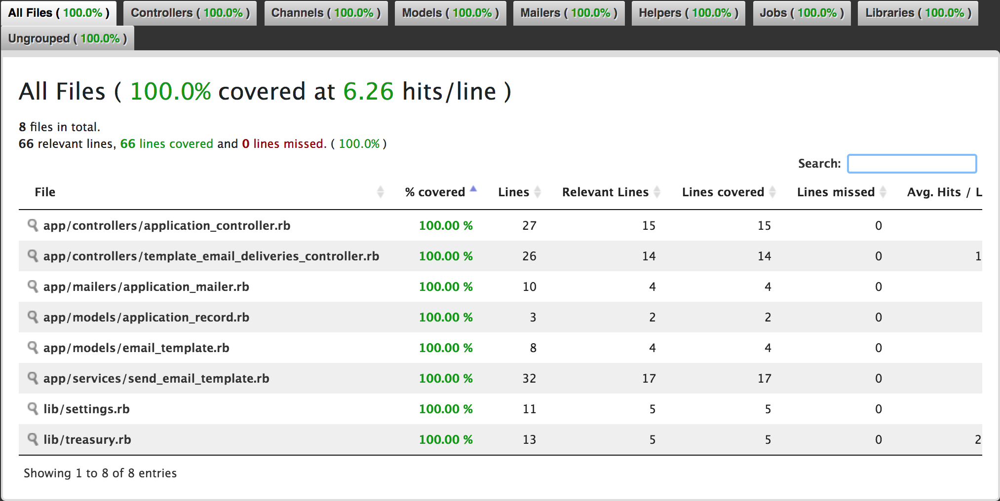
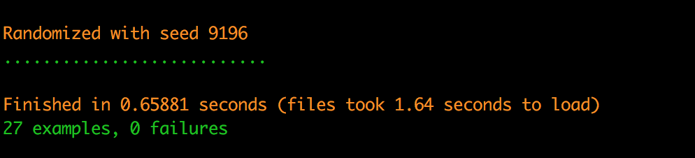

# Service B

This is a repository that stores multiple email templates.
It allows to sent an email based on template and delivered payload.


## Required environmental variables

Basic auth credentials
```
SERVICE_B_BASIC_AUTH_USERNAME=service_b
SERVICE_B_BASIC_AUTH_PASSWORD=service_b
```
SMTP settings
```
SMTP_SERVER=smtp_server
SMTP_PORT=smtp_port
SMTP_USERNAME=smtp_username
SMTP_PASSWORD=smtp_password
```

## Simple running instruction until docker files will be ready

1. Set all required environmental variables the way you prefer. For example you can copy then edit .env using .env.example

    ``` cp .env.example .env ```

2. Setup connection for postgres. You can copy then edit config/database.yml using config/database.yml.example

   ``` cp config/database.yml.example cp config/database.yml ```

3. Setup database with 

    ``` rails db:setup ```

4. Run application server

    ``` rails s ```


## Other commands useful during development

1. Run specs

    ``` rspec ```

2. Run specs with code coverage

    ``` COVERAGE=true rspec ```
    ``` open tmp/reports/coverage/index.html ```

3. Launch console if needed

    ``` rails c ```

4. Check new code with cops during development

    ``` pronto run -r=flay rails_best_practices reek rubocop brakeman -c origin/develop ```

5. Run pronto with cops on whole code like

    ```pronto run --commit=$(git log --pretty=format:%H | tail -1)```


## Some screenshots for those who would like to skip application setup :)

#### Final email
<p>
  
  
</p>

#### Code coverage report
<p>
  
</p>

#### Rspec output
<p>
  
</p>
